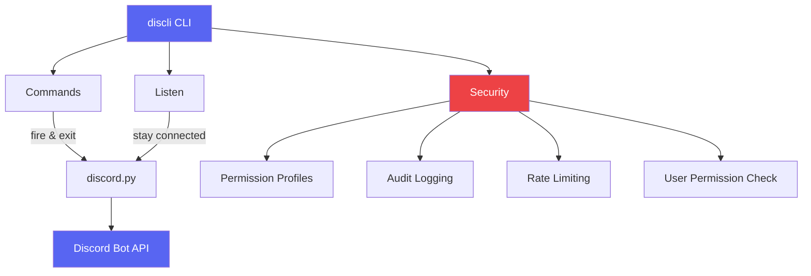
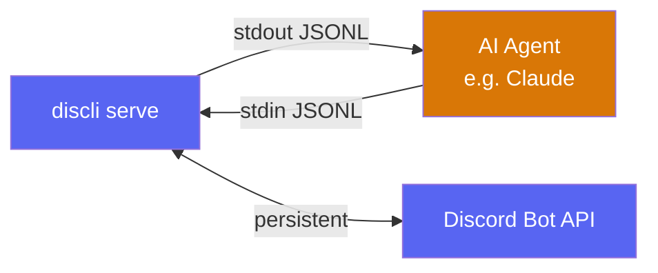
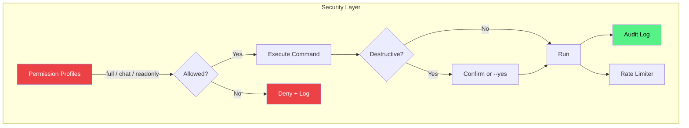

<p align="center">
  
</p>
<h1 align="center">discli</h1>
<p align="center">Discord CLI for AI agents and humans</p>

<p align="center">
  <a href="https://pypi.org/project/discord-cli-agent/"></a>
  <a href="https://pypi.org/project/discord-cli-agent/"></a>
  <a href="https://github.com/DevRohit06/discli/actions/workflows/release.yml"></a>
  <a href="https://github.com/DevRohit06/discli/blob/main/LICENSE"></a>
  <a href="https://github.com/DevRohit06/discli/releases"></a>
  <a href="https://github.com/DevRohit06/discli/stargazers"></a>
  <a href="https://www.producthunt.com/products/discli/discli/launch-day?utm_source=badge"></a>
</p>

---

Manage Discord servers, send messages, react, handle DMs, threads, and monitor events, all from the terminal. Built with security and AI agent integration in mind.

## How it works







## Install

```bash
# macOS/Linux
curl -fsSL https://raw.githubusercontent.com/DevRohit06/discli/main/installers/install.sh | bash

# Windows (PowerShell)
irm https://raw.githubusercontent.com/DevRohit06/discli/main/installers/install.ps1 | iex
```

Or with pip:

```bash
pip install discord-cli-agent
```

Requires Python 3.10+.

## Setup

1. Create a bot at [Discord Developer Portal](https://discord.com/developers/applications)
2. Enable **all privileged intents** (Presence, Server Members, Message Content)
3. Add the bot to your server with appropriate permissions
4. Configure your token:

```bash
# Option A: Save to config
discli config set token YOUR_BOT_TOKEN

# Option B: Environment variable
export DISCORD_BOT_TOKEN=YOUR_BOT_TOKEN

# Option C: Pass directly
discli --token YOUR_BOT_TOKEN server list
```

## Usage

Every command supports `--json` for machine-readable output.

### Messages

```bash
discli message send #general "Hello world!"
discli message send #general "Check this out" --embed-title "News" --embed-desc "Big update"
discli message send #general "Here's the report" --file report.pdf
discli message send #general "Screenshots" --file bug.png --file logs.txt
discli message list #general --limit 20
discli message list #general --after 2026-03-01 --before 2026-03-14
discli message get #general 123456789
discli message reply #general 123456789 "Here you go" --file fix.patch
discli message edit #general 123456789 "Updated text"
discli message delete #general 123456789
```

### Search & History

```bash
# Search messages by content
discli message search #general "bug report" --limit 100
discli message search #general "help" --author alice --after 2026-03-01

# Deep history backfill
discli message history #general --days 7
discli message history #general --hours 24 --limit 500
```

### Direct Messages

```bash
discli dm send alice "Hey, need help?"
discli dm send alice "Check this file" --file notes.pdf
discli dm send 123456789 "Sent by user ID"
discli dm list alice --limit 10
```

### Reactions

```bash
discli reaction add #general 123456789 👍
discli reaction remove #general 123456789 👍
discli reaction list #general 123456789
```

### Channels

```bash
discli channel list --server "My Server"
discli channel create "My Server" new-channel --type text
discli channel create "My Server" voice-room --type voice
discli channel info #general
discli channel delete #old-channel
```

### Threads

```bash
discli thread create #general 123456789 "Support Ticket"
discli thread list #general
discli thread send 987654321 "Following up on your issue"
discli thread send 987654321 "Attached the logs" --file debug.log
```

### Servers

```bash
discli server list
discli server info "My Server"
```

### Roles

```bash
discli role list "My Server"
discli role create "My Server" Moderator --color ff0000
discli role assign "My Server" alice Moderator
discli role remove "My Server" alice Moderator
discli role delete "My Server" Moderator
```

### Members

```bash
discli member list "My Server" --limit 100
discli member info "My Server" alice
discli member kick "My Server" alice --reason "Spam"
discli member ban "My Server" alice --reason "Repeated violations"
discli member unban "My Server" alice
```

### Typing Indicator

```bash
discli typing #general                # 5 seconds (default)
discli typing #general --duration 10  # 10 seconds
```

### Live Event Monitoring

```bash
# Listen to everything
discli listen

# Filter by server/channel
discli listen --server "My Server" --channel #general

# Filter by event type
discli listen --events messages,reactions

# Include bot messages (ignored by default)
discli listen --include-bots

# JSON output for piping to an agent
discli --json listen --events messages
```

Supported event types: `messages`, `reactions`, `members`, `edits`, `deletes`

### Persistent Bot (serve)

`discli serve` keeps a persistent connection and communicates via stdin/stdout JSONL — ideal for building full Discord bots.

```bash
# Start with slash commands and presence
discli serve --slash-commands commands.json --status online --activity playing --activity-text "Helping"

# Filter by server
discli serve --server "My Server"
```

**Events (stdout):**
```json
{"event": "ready", "bot_id": "123", "bot_name": "MyBot#1234"}
{"event": "message", "channel_id": "456", "author": "alice", "content": "hello", "mentions_bot": true, ...}
{"event": "slash_command", "command": "paw", "args": {"message": "hi"}, "interaction_token": "abc123", ...}
```

**Commands (stdin):**
```json
{"action": "send", "channel_id": "456", "content": "Hello!", "req_id": "1"}
{"action": "reply", "channel_id": "456", "message_id": "789", "content": "Hi!", "req_id": "2"}
{"action": "typing_start", "channel_id": "456"}
{"action": "typing_stop", "channel_id": "456"}
{"action": "presence", "status": "idle", "activity_type": "watching", "activity_text": "the logs"}
```

**Streaming edits** (bot response builds in real-time, edited every 1.5s):
```json
{"action": "stream_start", "channel_id": "456", "reply_to": "789"}
{"action": "stream_chunk", "stream_id": "s1", "content": "new tokens..."}
{"action": "stream_end", "stream_id": "s1"}
```

**Slash commands** are defined in a JSON file:
```json
[
  {"name": "paw", "description": "Talk to the bot", "params": [{"name": "message", "type": "string"}]},
  {"name": "new", "description": "Start a new session"}
]
```

## Security & Permissions

### Confirmation Prompts

Destructive actions (kick, ban, delete) require confirmation by default:

```bash
$ discli member kick "My Server" spammer
Warning: Destructive action: member kick (spammer from My Server). Continue? [y/N]

# Skip with --yes for automation
$ discli -y member kick "My Server" spammer --reason "Spam"
```

### Permission Profiles

Restrict which commands an agent can use:

```bash
# List available profiles
discli permission profiles

# Set a profile (persisted)
discli permission set chat        # Messages, reactions, threads only, no moderation
discli permission set readonly    # Can only read, no sending or deleting
discli permission set moderation  # Full access including kick/ban
discli permission set full        # Everything (default)

# Override per invocation (not persisted)
discli --profile chat message send #general "hello"
DISCLI_PROFILE=readonly discli message list #general
```

| Profile | Can Send | Can Delete | Can Kick/Ban | Can Manage Channels |
|---------|----------|------------|--------------|---------------------|
| `full` | Yes | Yes | Yes | Yes |
| `moderation` | Yes | Yes | Yes | Yes |
| `chat` | Yes | No | No | No |
| `readonly` | No | No | No | No |

### User Permission Checking

Verify the Discord user who triggered an action actually has the required permissions:

```bash
discli member kick "My Server" target --triggered-by 123456789
```

This checks that user `123456789` has `kick_members` permission in the server. Server owners and administrators always pass. If the user can't be found in cache, it fetches from the API. If that also fails, it warns but doesn't block.

### Audit Log

Every destructive action is logged to `~/.discli/audit.log`:

```bash
# View recent actions
discli audit show --limit 20

# JSON output
discli --json audit show

# Clear the log
discli audit clear
```

### Rate Limiting

Built-in rate limiter (5 calls per 5 seconds) on destructive actions to prevent Discord API bans. If the limit is hit, discli waits automatically.

## Resolving Identifiers

All commands accept both **IDs** and **names**:

| Type | By ID | By Name |
|------|-------|---------|
| Channel | `123456789` | `#general` |
| Server | `123456789` | `My Server` |
| Member | `123456789` | `alice` |
| Role | `123456789` | `Moderator` |
| Thread | `123456789` | `Support Ticket` |
| User (DM) | `123456789` | `alice` |

## JSON Output

Add `--json` **before the subcommand** for machine-readable output:

```bash
$ discli --json message list #general --limit 1
[
  {
    "id": "123456789",
    "author": "alice",
    "content": "Hello!",
    "timestamp": "2026-03-14T10:32:00+00:00",
    "attachments": [],
    "embeds": []
  }
]

$ discli --json listen --events messages
{"event": "message", "server": "My Server", "channel": "general", "channel_id": "111", "author": "alice", "author_id": "222", "content": "hello", "message_id": "333", "mentions_bot": false, "attachments": []}
```

## Examples

Ready-to-run examples in the [`examples/`](examples/) directory:

| Example | Description |
|---------|-------------|
| [`serve_bot.py`](examples/serve_bot.py) | Full bot using `discli serve` with streaming responses and slash commands |
| [`claude_agent.py`](examples/claude_agent.py) | AI support agent powered by Claude Agent SDK with persistent session |
| [`support_agent.py`](examples/support_agent.py) | Keyword-based support bot that replies to @mentions |
| [`thread_support_agent.py`](examples/thread_support_agent.py) | Creates a thread per support request and continues conversations inside |
| [`moderation_bot.py`](examples/moderation_bot.py) | Watches for banned words, warns users, kicks after repeated violations |
| [`channel_logger.sh`](examples/channel_logger.sh) | Logs all messages from a channel to a JSONL file |
| [`reaction_poll.sh`](examples/reaction_poll.sh) | Creates a poll with emoji reactions |

### Agent Instructions

The [`agents/discord-agent.md`](agents/discord-agent.md) file contains the full discli command reference for AI agents. Drop it into any agent's system prompt. Works with Claude, OpenAI, LangChain, or any framework.

### Quick start: Claude Agent

```bash
pip install discord-cli-agent claude-agent-sdk
discli config set token YOUR_BOT_TOKEN
python examples/claude_agent.py
```

Uses your existing Claude Code authentication. No API key needed.

### Quick start: Bash agent loop

```bash
discli --json listen --events messages | while read -r event; do
  mentions_bot=$(echo "$event" | jq -r '.mentions_bot')
  if [ "$mentions_bot" = "true" ]; then
    channel_id=$(echo "$event" | jq -r '.channel_id')
    message_id=$(echo "$event" | jq -r '.message_id')
    discli typing "$channel_id" --duration 3 &
    discli message reply "$channel_id" "$message_id" "Hello! How can I help?"
  fi
done
```

## Project Structure

```
discli/
├── src/discli/
│   ├── cli.py           # Root click group + permission/audit commands
│   ├── client.py        # Async discord.py wrapper
│   ├── config.py        # Token storage (~/.discli/config.json)
│   ├── security.py      # Permissions, audit logging, rate limiting
│   ├── utils.py         # Output formatting, resolvers
│   └── commands/        # Command groups (message, channel, serve, etc.)
├── agents/
│   └── discord-agent.md # Full command reference for AI agents
├── examples/            # Ready-to-run agent examples
├── installers/          # curl-friendly install scripts
├── tests/               # Unit tests
└── pyproject.toml
```

## Configuration

Config is stored at `~/.discli/config.json`.

```bash
discli config set token YOUR_TOKEN
discli config show
discli config show --json
```

Token resolution order: `--token` flag > `DISCORD_BOT_TOKEN` env var > config file.

## Contributing

See [CONTRIBUTING.md](CONTRIBUTING.md) for development setup, how to add commands, and release process.

## License

MIT
