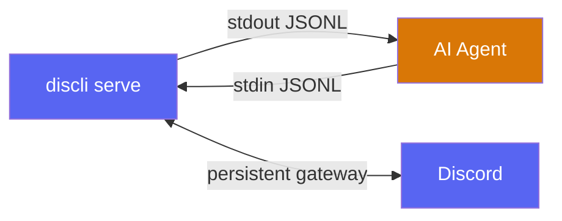

<p align="center">
  
</p>
<h1 align="center">discli</h1>
<p align="center">Discord CLI for AI agents and humans</p>

<p align="center">
  <a href="https://pypi.org/project/discord-cli-agent/"></a>
  <a href="https://pypi.org/project/discord-cli-agent/"></a>
  <a href="https://github.com/DevRohit06/discli/actions/workflows/release.yml"></a>
  <a href="https://github.com/DevRohit06/discli/blob/main/LICENSE"></a>
  <a href="https://github.com/DevRohit06/discli/releases"></a>
  <a href="https://github.com/DevRohit06/discli/stargazers"></a>
  <a href="https://www.producthunt.com/products/discli/discli/launch-day?utm_source=badge"></a>
</p>

---

A scriptable terminal interface to Discord — messages, channels, threads, members, polls, voice (TTS / STT / live transcription), and interactive components (modals, workflows, dashboards). Designed for **piping to and from AI agents** with a JSONL serve protocol, permission profiles, and per-command audit logging.

## In 30 seconds

```bash
pip install 'discord-cli-agent[voice,deepgram]' claude-agent-sdk
discli config set token YOUR_BOT_TOKEN
export DEEPGRAM_API_KEY=...

python examples/meeting_transcriber.py <voice_channel_id>
```

```
Listening to #standup. Transcript: ~/.discli/transcripts/meeting-20260514-103000.md
Press Ctrl+C to stop and generate a summary.

- **[10:30:14] Roy:** ok let's go around — what did everyone do yesterday
- **[10:30:22] Sara:** finished the auth migration, started on the rate limiter
- **[10:30:35] Roy:** nice — anything blocking
^C
Generating summary from 47 line(s)…

## Summary
Standup covering yesterday's work. Sara finished the auth migration; rate limiter is next.

## Action items
- Sara: finish rate limiter today.
- Roy: write the migration runbook by Friday.
```

That's a full meeting transcriber — DAVE-aware voice receive, speaker-labelled transcripts, Claude-generated summary on exit — running on top of `discli` primitives.

## Why discli

- **CLI-native**: every Discord operation is a `discli ...` command with `--json` output. Pipe it through `jq`, wrap it in bash, drive it from any language.
- **Built for AI agents**: a long-running `discli serve` mode speaks JSONL over stdin/stdout — feed it directly to Claude Agent SDK, OpenAI, LangChain, or your own loop.
- **Voice that actually works**: server voice channels, streaming STT (Deepgram / Whisper), TTS (ElevenLabs / OpenAI / Aura), and the DAVE-encryption patch that makes listening work on modern Discord.
- **Secure by default**: permission profiles (`full` / `chat` / `readonly` / `moderation`), per-command audit log, built-in rate limiter, optional triggering-user permission checks.

## Install

```bash
pip install discord-cli-agent
```

Requires Python 3.10+. For voice (TTS / STT / meeting transcription) install the `voice` extra plus a provider:

```bash
pip install 'discord-cli-agent[voice,deepgram]'
# or with uv
uv add 'discord-cli-agent[voice,deepgram]'
```

You'll also need **libopus** (`apt install libopus0` / `brew install opus`) and **ffmpeg** for `voice play` / TTS playback. The full install matrix is in [`docs/getting-started/installation.mdx`](docs/getting-started/installation.mdx).

## Setup

1. Create a bot at [Discord Developer Portal](https://discord.com/developers/applications).
2. Enable the intents you need (Message Content is required for reading messages; Members for member lookups; Voice State for voice tracking).
3. Add the bot to your server with the permissions your use case actually needs — least privilege beats "enable everything".
4. Save your token:

   ```bash
   discli config set token YOUR_BOT_TOKEN
   ```

5. Verify the install:

   ```bash
   discli doctor
   ```

   `doctor` checks CORE / VOICE / STT / TTS / TOOLS. Optional pieces you haven't asked for stay silent — text-only devs see a clean two-section report.

## Features at a glance

| Category | What's in it | Docs |
|----------|--------------|------|
| Messaging | send, reply, edit, delete, bulk-delete, search, history, embeds, attachments, components | [CLI Commands](docs/reference/cli-commands.mdx#message) |
| DMs & Threads | send / list DMs, create / list / archive threads | [CLI Commands](docs/reference/cli-commands.mdx#dm) |
| Channels & Servers | list / info / create / edit / delete channels and roles, list servers and members | [CLI Commands](docs/reference/cli-commands.mdx#channel) |
| Reactions & Polls | add, remove, list, users; create polls with multiple choices | [CLI Commands](docs/reference/cli-commands.mdx#reaction) |
| Voice | join / leave / speak / play, streaming STT, debug capture, status lookups | [Voice guide](docs/guides/voice.mdx) |
| Interactive | modals, multi-step workflows with state + timeout, persistent dashboards | [Components & Modals](docs/guides/components-modals.mdx) |
| Live events | real-time event stream (`discli listen`) with filtering | [Streaming](docs/guides/streaming-responses.mdx) |
| Persistent bot | `discli serve` — bidirectional JSONL over stdin/stdout, 54 actions, 17 events | [Serve Mode](docs/guides/serve-mode.mdx) |
| Slash commands | declarative JSON, hot-reload friendly | [Slash Commands](docs/guides/slash-commands.mdx) |
| Doctor | one-shot setup verification | [`discli doctor`](docs/reference/cli-commands.mdx#doctor) |

Every command supports `--json` for machine-readable output. Identifiers accept both IDs and names (`#general` or `123456789`, `alice` or her snowflake).

## Security & permissions

Four built-in profiles control which commands an invocation can run:

| Profile | Description | Voice | Destructive ops |
|---------|-------------|-------|-----------------|
| `full` | Everything (default) | yes | yes |
| `moderation` | Everything including bans / kicks / role mgmt | yes | yes |
| `chat` | Messages, reactions, threads, interactions | denied | denied |
| `readonly` | List / info / get / search + stateless voice lookups | status / where / members | denied |

```bash
discli --profile chat message send #general "hi"     # ok
discli --profile chat voice join general              # denied
discli --profile chat channel delete announcements    # denied
```

Every destructive action is logged to `~/.discli/audit.log`. View with `discli audit show`. The full security model — including triggering-user permission checks and the rate limiter — is in [`docs/architecture/security-model.mdx`](docs/architecture/security-model.mdx).

## Examples

The headline example is `examples/meeting_transcriber.py` (the one above). The rest:

| Example | What it does |
|---------|--------------|
| [`ai_serve_agent.py`](examples/ai_serve_agent.py) | All-in-one Claude agent using `discli serve` — messages, buttons, selects, modals, streaming |
| [`meeting_transcriber.py`](examples/meeting_transcriber.py) | Live voice transcript + Claude summary on Ctrl+C |
| [`claude_agent.py`](examples/claude_agent.py) | Voice + interactive Claude agent (`@mention` driven) |
| [`component_test_bot.py`](examples/component_test_bot.py) | Buttons / selects / modals / embeds / streaming reference |
| [`serve_bot.py`](examples/serve_bot.py) | Minimal echo bot using `discli serve` |
| [`moderation_bot.py`](examples/moderation_bot.py) | Keyword filter with warnings and kick escalation |
| [`support_agent.py`](examples/support_agent.py) | Rule-based support bot replying to @mentions |
| [`thread_support_agent.py`](examples/thread_support_agent.py) | Thread-per-ticket helpdesk |
| [`channel_logger.sh`](examples/channel_logger.sh) | Log messages to JSONL |
| [`reaction_poll.sh`](examples/reaction_poll.sh) | Emoji reaction poll |

The full reference [`agents/discord-agent.md`](agents/discord-agent.md) can be dropped into any agent's system prompt — works with Claude, OpenAI, LangChain, or anything that takes a prompt.

**Bash agent in 8 lines** (no Python required):

```bash
discli --json listen --events messages | while read -r event; do
  mentions_bot=$(echo "$event" | jq -r '.mentions_bot')
  if [ "$mentions_bot" = "true" ]; then
    channel=$(echo "$event" | jq -r '.channel_id')
    msg=$(echo "$event" | jq -r '.message_id')
    discli message reply "$channel" "$msg" "Hello! How can I help?"
  fi
done
```

## Architecture


```mermaid
graph LR
    A[discli serve] -->|stdout JSONL| B[AI Agent]
    B -->|stdin JSONL| A
    A <-->|persistent gateway| C[Discord]

    style A fill:#5865F2,color:#fff
    style B fill:#D97706,color:#fff
    style C fill:#5865F2,color:#fff
```

Fire-and-exit commands for scripts; persistent `serve` mode for agents. Both share the same security layer (profiles, audit, rate limiter, optional triggering-user perm checks). Voice receive monkeypatches `discord-ext-voice-recv` at load time to insert DAVE decryption between SecretBox and libopus — see [`docs/guides/voice.mdx`](docs/guides/voice.mdx#behind-the-scenes--dave-encryption) for the details.

Full architecture overview: [`docs/architecture/overview.mdx`](docs/architecture/overview.mdx).

## Configuration

```bash
discli config set token YOUR_TOKEN
discli config show
discli config show --json
```

Stored at `~/.discli/config.json`. Token resolution order: `--token` flag → `DISCORD_BOT_TOKEN` env var → config file.

## Documentation

Full docs live in [`docs/`](docs/) (Lito-based, sourced as `.mdx`):

- [Installation](docs/getting-started/installation.mdx) · [Quickstart](docs/getting-started/quickstart.mdx) · [Configuration](docs/getting-started/configuration.mdx)
- Guides: [CLI Usage](docs/guides/cli-usage.mdx) · [Serve Mode](docs/guides/serve-mode.mdx) · [Voice](docs/guides/voice.mdx) · [Components & Modals](docs/guides/components-modals.mdx) · [Building Agents](docs/guides/building-agents.mdx)
- Reference: [CLI Commands](docs/reference/cli-commands.mdx) · [Serve Actions](docs/reference/serve-actions.mdx) · [Serve Events](docs/reference/serve-events.mdx) · [Permission Profiles](docs/reference/permission-profiles.mdx)
- [Troubleshooting](docs/troubleshooting/common-issues.mdx)

## Contributing

See [CONTRIBUTING.md](CONTRIBUTING.md). Tests run via `uv run pytest tests/`; conventional commits (`feat:`, `fix:`, `docs:`, `chore:`).

## License

MIT — see [LICENSE](LICENSE).
