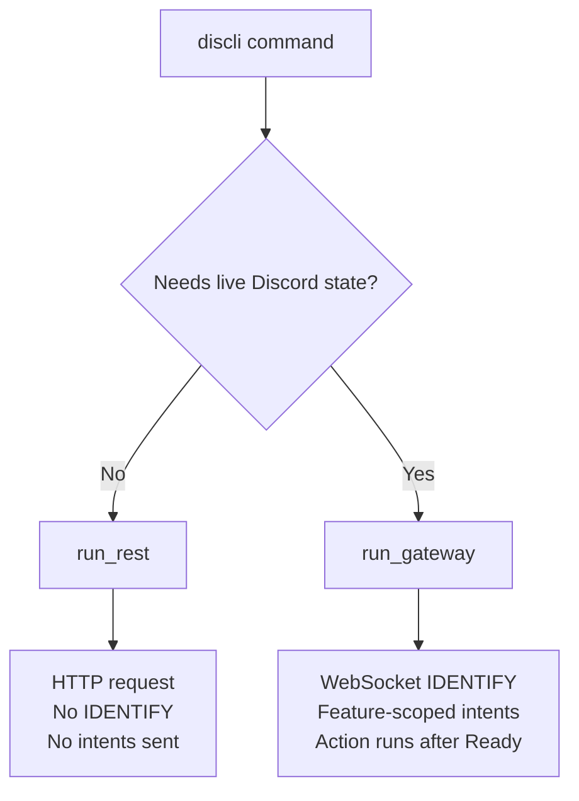

# Connection Model

discli talks to Discord over two different transports, and which one a command uses determines
what you have to enable in the Developer Portal.

- **HTTP (REST)** — a request/response call over `discord.com/api`. Authenticated with a bot
  token, no persistent socket, **no intents transmitted**.
- **Gateway** — a persistent WebSocket. Opening one sends an `IDENTIFY` payload that declares
  the intents the bot wants, consumes session-start quota, and is rejected outright if a
  declared privileged intent is disabled in the Developer Portal.

Every one-shot discli command uses HTTP. Only features that need live Discord state open a
Gateway session.

<Callout type="note">
Before v0.10.0, *every* command opened a Gateway session with `Intents.all()`. That meant a
`discli message send` failed if an unrelated privileged intent was switched off, and burned
session-start capacity for a single HTTP call. See [Migrating from the old
model](#migrating-from-the-old-model).
</Callout>

## Which path does my command use?



| Path | Commands | Transport |
|---|---|---|
| **REST** | `message`, `reaction`, `channel`, `role`, `member`, `thread`, `poll`, `webhook`, `event`, `dm`, `typing`, `server`, `interact` | HTTP only |
| **Gateway (one-shot)** | `voice` subcommands | WebSocket, closed after the action |
| **Gateway (persistent)** | `listen`, `serve` | WebSocket, held open |

`interact` is on the REST path because it posts components over HTTP; the *responses* to those
components arrive through a running `discli serve`, not through the command that posted them.

## Intents per feature

Gateway commands build the smallest intent set that covers the features they were asked for,
via `build_gateway_intents()` in `client.py`. discli never sends `Intents.all()`.

| Feature | Enabled intents | Privileged? |
|---|---|---|
| *(always)* | `guilds` | No |
| `messages` | `guild_messages`, `dm_messages`, `message_content` | **Message Content** |
| `reactions` | `guild_messages`, `dm_messages`, `guild_reactions`, `dm_reactions` | No |
| `members` | `members` | **Server Members** |
| `voice` | `voice_states` | No |

The `reactions` feature enables message intents without `message_content`: discord.py needs
message-create events to populate the cache its reaction events read from, but it does not need
the message bodies.

`discli listen --events ...` and `discli serve --events ...` map their event filters onto these
features, so a narrower `--events` filter means a narrower `IDENTIFY`:

```bash
# Requests guilds + reactions only. Message Content stays off.
discli listen --events reactions

# Requests guilds + messages + message_content. Needs the Message Content intent.
discli listen --events messages
```

`discli serve` always adds the `voice` feature on top of its event filter, because it accepts
voice actions dynamically over stdin and cannot know in advance whether you will send one.

## What still needs a privileged intent

Dropping the Gateway session does not exempt a command from Discord's server-side rules. Some
HTTP endpoints and response fields are gated on your application's intent settings regardless of
transport:

- **Listing all guild members** (`discli member list`, `discli role list --with-member-counts`)
  requires **Server Members**. Without it Discord returns `403`, and discli reports member
  counts as `unavailable` rather than a misleading `0`.
- **Reading arbitrary message content** can require **Message Content**.

The difference is what happens when the intent is missing. On the Gateway path, Discord rejects
the whole connection with `PrivilegedIntentsRequired`. On the REST path, the specific call
returns `403` and everything else keeps working.

<Callout type="tip">
Name-based member and user lookup resolves cache-first, then falls back to HTTP. On a one-shot
command the cache is empty, so `discli member info "server" "alice"` hits the REST fallback and
needs Server Members. Passing the numeric ID skips the search entirely and works with no
privileged intents at all.
</Callout>

## Practical consequences

- **Least privilege actually works.** Enable Message Content only if you consume live message
  events; enable Server Members only if you list or name-search members. A REST-only workflow
  can run with both switched off.
- **No session-start burn.** Discord caps `IDENTIFY` calls per day. A cron job firing
  `discli message send` every minute no longer counts against that cap.
- **Rate limits, not handshakes.** One-shot commands are bounded by Discord's HTTP rate limits
  instead of a WebSocket handshake, so they return faster and fail differently — expect `429`
  under load rather than a connection error.
- **One `serve` per token still holds.** Discord permits a single Gateway connection per bot
  token without sharding. That constraint applies to `listen`, `serve`, and `voice` — the
  commands that still open sockets. REST commands can run concurrently alongside a live
  `discli serve`.

## Migrating from the old model

Nothing in the CLI surface changed, but two behaviours did:

1. **Commands that used to fail on missing intents now succeed.** If you enabled privileged
   intents purely to make one-shot commands work, you can turn them back off.
2. **`discli role list` no longer computes member counts by default.** Counting them iterates the
   whole member list — slow, rate-limit-prone, and privileged. Pass `--with-member-counts` (CLI)
   or `"with_member_counts": true` (serve action) to restore the old output. Without it,
   `members` is reported as `unavailable` / `null`.

`run_discord()` is still exported from `client.py` as an alias of `run_rest()` for anything
importing it directly.
