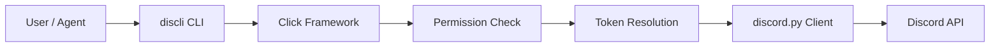
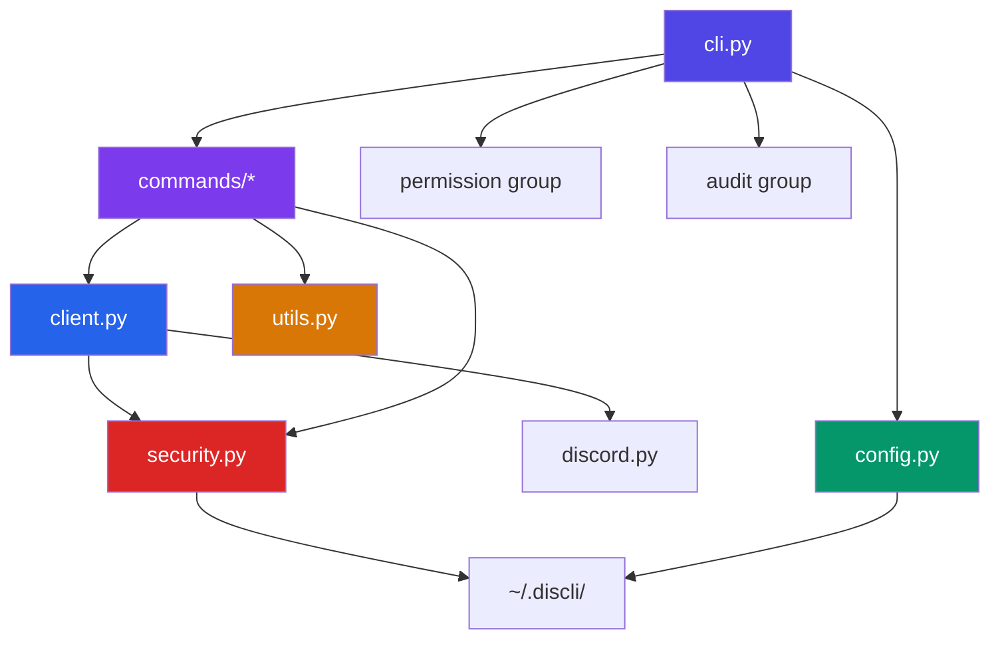
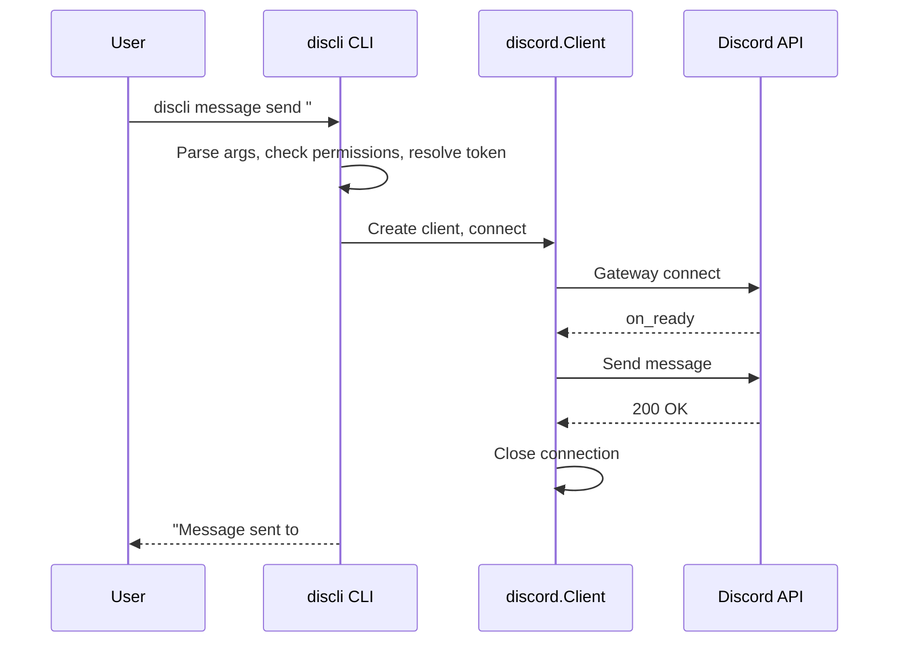
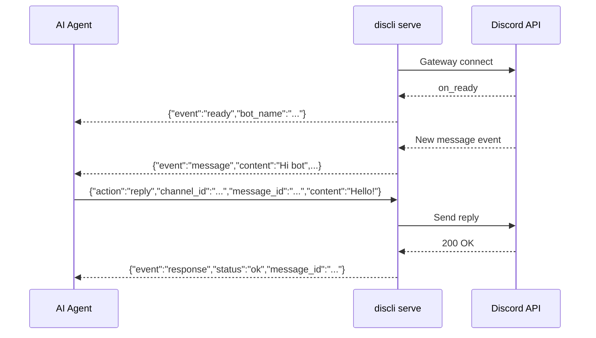

# Architecture Overview

discli is a Python CLI built on [Click](https://click.palletsprojects.com/) and [discord.py](https://discordpy.readthedocs.io/). It operates in two distinct modes: **fire-and-forget CLI commands** for one-off operations, and a **persistent serve mode** for real-time bidirectional communication with AI agents.

## High-level request flow

Every discli invocation follows this pipeline, from user input to Discord API call:



1. The user (or an AI agent) invokes a `discli` command.
2. Click parses arguments and global options (`--token`, `--json`, `--yes`, `--profile`).
3. The active permission profile is checked to confirm the command is allowed.
4. The bot token is resolved from flag, environment variable, or config file.
5. A temporary `discord.Client` connects, executes the action on `on_ready`, and disconnects.
6. The Discord API processes the request.

## Module dependency graph



## Module roles

| Module | File | Purpose |
|---|---|---|
| **CLI entry point** | `cli.py` | Click root group. Registers all command groups, defines global options, hosts `permission` and `audit` subcommands. |
| **Commands** | `commands/*.py` | Each file defines a Click command group (e.g., `message`, `channel`, `role`). Commands build an async action function and hand it to `run_discord()`. |
| **Client** | `client.py` | `resolve_token()` resolves the bot token. `run_discord()` checks permissions, creates a temporary `discord.Client`, runs the action on `on_ready`, and tears down the connection. |
| **Security** | `security.py` | Permission profiles (allow/deny lists), `is_command_allowed()` enforcement, `audit_log()` JSONL writer, `RateLimiter` (token bucket), `check_user_permission()` for Discord-level permission checks, destructive action confirmation. |
| **Config** | `config.py` | Reads/writes `~/.discli/config.json`. Handles token persistence and config merging. |
| **Utils** | `utils.py` | `output()` respects the `--json` flag. `resolve_channel()` and `resolve_guild()` translate names/IDs to discord.py objects. |
| **Serve** | `commands/serve.py` | Persistent bot mode. Reads JSONL from stdin, writes JSONL to stdout. ~1100 lines covering 25+ actions, event forwarding, slash command registration, and streaming with 1.5s flush intervals. |

## Two operating modes

### Mode 1: Fire-and-forget CLI commands

This is the default mode. Each command creates a short-lived `discord.Client`, performs one operation, and exits.



This approach is simple and stateless. The connection lives only as long as the single API call takes. The trade-off is connection overhead on every invocation (typically 1-2 seconds for the gateway handshake).

**Best for:** scripting, cron jobs, one-off operations, piping into other tools.

### Mode 2: Persistent serve mode

`discli serve` starts a long-lived bot that communicates over stdin/stdout using newline-delimited JSON (JSONL). The bot stays connected to Discord's gateway and forwards events in real time.



Serve mode maintains persistent state:
- **Typing indicators** per channel (start/stop via actions)
- **Streaming edits** that batch content updates every 1.5 seconds to stay within Discord rate limits
- **Slash command registrations** synced per guild on startup
- **Interaction tokens** for deferred slash command responses

**Best for:** AI agents, chatbots, real-time monitoring, interactive applications.

<Callout type="info">
  Serve mode uses a thread-based stdin reader instead of `asyncio.connect_read_pipe` because the latter fails on Windows when stdin is a pipe from a parent process. The reader thread puts lines into a `queue.Queue`, and the asyncio event loop polls it via `run_in_executor`.
</Callout>

## Command registration

All command groups are registered in `cli.py` via `main.add_command()`:

```python
main.add_command(channel_group)
main.add_command(config_group)
main.add_command(dm_group)
main.add_command(listen_cmd)
main.add_command(member_group)
main.add_command(message_group)
main.add_command(reaction_group)
main.add_command(role_group)
main.add_command(server_group)
main.add_command(poll_group)
main.add_command(thread_group)
main.add_command(typing_cmd)
main.add_command(serve_cmd)
main.add_command(permission_group)
main.add_command(audit_group)
```

Each command group maps to a file in `commands/`. Adding a new command group follows the same pattern: define Click commands in a new file, register the group in `cli.py`.

## Key design decisions

| Decision | Rationale |
|---|---|
| **Click over argparse** | Click provides nested command groups, automatic help generation, and context passing -- a natural fit for discli's `discli <group> <command>` structure. |
| **Temporary client per CLI command** | Keeps commands stateless and avoids connection management. The 1-2s overhead is acceptable for scripting use cases. |
| **JSONL for serve protocol** | Newline-delimited JSON is trivial to parse in any language, streamable, and unambiguous. Every agent framework can read/write it. |
| **Permission profiles at the CLI layer** | Prevents accidental misuse before any Discord API call is made. An agent with a `readonly` profile cannot send messages regardless of the bot's Discord permissions. |
| **Separate security module** | Centralizes permission checks, audit logging, and rate limiting so every command path goes through the same enforcement. |

## Next steps

<CardGroup cols={2}>
  <Card title="Serve Protocol" href="/architecture/serve-protocol">
    Full specification of the JSONL stdin/stdout protocol for serve mode.
  </Card>
  <Card title="Security Model" href="/architecture/security-model">
    Permission profiles, audit logging, rate limiting, and destructive action guards.
  </Card>
  <Card title="Token Resolution" href="/architecture/token-resolution">
    How discli finds your bot token across flags, env vars, and config files.
  </Card>
  <Card title="CLI Usage Guide" href="/guides/cli-usage">
    Practical guide to using discli commands day-to-day.
  </Card>
</CardGroup>
