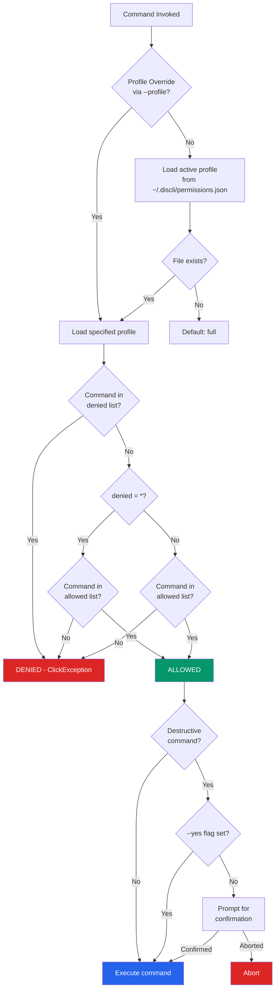
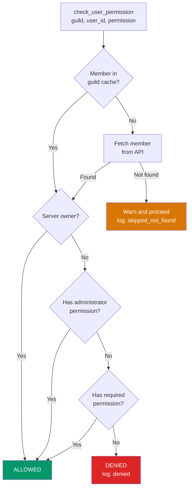

# Security Model

discli implements a layered security model that operates at the CLI level, before any Discord API call is made. This means an AI agent running with a `readonly` profile cannot send messages, regardless of what the underlying bot token allows on Discord.

## Permission enforcement pipeline



## Permission profiles

discli ships with four built-in profiles. Each profile defines an `allowed` list and a `denied` list. The wildcard `*` matches all commands.

<Tabs>
  <Tab title="full">
    ```json
    {
      "description": "Full access to all commands",
      "allowed": ["*"],
      "denied": []
    }
    ```
    The default profile. Every command is permitted.
  </Tab>
  <Tab title="chat">
    ```json
    {
      "description": "Messages, reactions, threads, typing only",
      "allowed": [
        "message", "reaction", "thread", "typing",
        "dm", "listen", "serve", "config", "server"
      ],
      "denied": [
        "member kick", "member ban", "member unban",
        "channel delete", "role delete", "role create",
        "channel create"
      ]
    }
    ```
    Allows conversational commands. Blocks moderation and structural changes.
  </Tab>
  <Tab title="readonly">
    ```json
    {
      "description": "Read-only: list, info, get, search, listen",
      "allowed": [
        "message list", "message get", "message search",
        "message history", "channel list", "channel info",
        "server list", "server info", "role list",
        "member list", "member info", "reaction list",
        "thread list", "listen", "config show"
      ],
      "denied": ["*"]
    }
    ```
    Only read operations are allowed. The `denied: ["*"]` catches everything not explicitly in the allowed list.
  </Tab>
  <Tab title="moderation">
    ```json
    {
      "description": "Full access including moderation",
      "allowed": ["*"],
      "denied": []
    }
    ```
    Currently identical to `full`. Exists as a distinct profile for semantic clarity and future differentiation.
  </Tab>
</Tabs>

### How `is_command_allowed()` works

Permission checking follows a deny-first strategy:

1. **Resolve the profile.** If `--profile` is passed, use that built-in profile. Otherwise, load from `~/.discli/permissions.json` (defaulting to `full` if the file does not exist).
2. **Check denied list first.** If `denied` contains `*`, everything is denied unless explicitly in `allowed`. If the command matches a specific denied pattern, it is blocked.
3. **Check allowed list.** If `allowed` contains `*`, the command passes. Otherwise, the command must match an allowed pattern.
4. **Pattern matching** uses prefix matching: `"message"` allows `message send`, `message list`, `message delete`, etc. The exact command path `"message send"` only allows that specific command.

```python
# These patterns match "message send":
"*"              # wildcard
"message"        # prefix match
"message send"   # exact match

# These do NOT match "message send":
"message list"   # different subcommand
"msg"            # not a prefix of the command path
```

### Setting the active profile

```bash
# Set profile for all future commands
discli permission set readonly

# Override for a single command
discli --profile chat message send "#general" "Hello"

# Show current profile
discli permission show

# List all profiles
discli permission profiles
```

### Custom profiles

Create custom profiles by editing `~/.discli/permissions.json`:

```json
{
  "active_profile": "support-agent",
  "profiles": {
    "support-agent": {
      "description": "Can read and reply, but not delete or manage",
      "allowed": [
        "message list", "message get", "message search",
        "message send", "reply",
        "channel list", "channel info",
        "server list", "server info",
        "thread list", "thread create", "thread send",
        "typing", "reaction", "listen", "serve"
      ],
      "denied": [
        "message delete",
        "member kick", "member ban",
        "channel delete", "channel create",
        "role delete", "role assign", "role remove"
      ]
    }
  }
}
```

Custom profiles take precedence over built-in profiles when they share the same name. The `active_profile` key determines which profile is loaded by default.

## Destructive action confirmation

Certain commands are flagged as destructive and require explicit confirmation before execution:

| Command | Action |
|---|---|
| `member kick` | Remove a member from the server |
| `member ban` | Ban a member from the server |
| `member unban` | Unban a previously banned member |
| `channel delete` | Delete a channel permanently |
| `message delete` | Delete a message |
| `role delete` | Delete a role |

When a destructive command runs, discli prompts:

```
⚠ Destructive action: member kick (user: Alice#1234). Continue? [y/N]
```

To skip the prompt (for automation), pass `--yes` or `-y`:

```bash
discli --yes message delete "#general" 123456789
```

<Callout type="warning">
  The `--yes` flag bypasses all confirmation prompts. Use it carefully in automated pipelines. Pair it with a restrictive permission profile to limit what can be auto-confirmed.
</Callout>

## Audit logging

Every command execution is recorded in a JSONL audit log at `~/.discli/audit.log`. Each line is a JSON object:

```json
{
  "timestamp": "2026-03-15T10:30:00.123456+00:00",
  "command": "message send",
  "args": {"channel": "#general", "content": "Hello"},
  "result": "ok",
  "user": ""
}
```

| Field | Description |
|---|---|
| `timestamp` | ISO 8601 UTC timestamp |
| `command` | The command path that was executed |
| `args` | Arguments passed to the command (tokens are never included) |
| `result` | `"ok"` on success, or an error description |
| `user` | The Discord user who triggered the action (populated by `--triggered-by` or slash commands) |

### Viewing and managing the audit log

```bash
# Show last 20 entries
discli audit show

# Show last 50 entries
discli audit show --limit 50

# Show as JSON
discli --json audit show

# Clear the log
discli audit clear
```

<Callout type="note">
  The audit log also records permission check events. When `check_user_permission()` denies a user or cannot resolve a member, a `permission_check` entry is written with the result (`denied` or `skipped_not_found`).
</Callout>

## Rate limiting

discli includes a client-side rate limiter to prevent hitting Discord's API rate limits. It uses a **token bucket algorithm**:

- **Bucket size:** 5 tokens (calls)
- **Refill window:** 5 seconds
- **Behavior:** When the bucket is empty, discli auto-waits until a token is available and prints a message to stderr

```
Rate limited. Waiting 3.2s...
```

The rate limiter is a global singleton (`security.rate_limiter`). It tracks call timestamps and prunes expired ones on each call:

```python
class RateLimiter:
    def __init__(self, max_calls: int = 5, period: float = 5.0):
        self.max_calls = max_calls
        self.period = period
        self.calls: list[float] = []

    def wait(self) -> None:
        now = time.time()
        self.calls = [t for t in self.calls if now - t < self.period]
        if len(self.calls) >= self.max_calls:
            sleep_time = self.period - (now - self.calls[0])
            if sleep_time > 0:
                time.sleep(sleep_time)
        self.calls.append(time.time())
```

This is a safety net on top of discord.py's own rate limit handling. It prevents burst scenarios where multiple CLI invocations in rapid succession could trigger Discord's global rate limits.

## Discord-level permission checks

For actions triggered by Discord users (e.g., via slash commands with `--triggered-by`), discli can verify that the triggering user has the required Discord permissions in the server.

`check_user_permission()` resolves the user and checks their server-level permissions:



Supported permission checks:

| Permission key | Discord permission |
|---|---|
| `kick` | `kick_members` |
| `ban` | `ban_members` |
| `manage_channels` | `manage_channels` |
| `manage_roles` | `manage_roles` |
| `manage_messages` | `manage_messages` |

<Callout type="info">
  If the member cannot be resolved (not in cache and fetch fails), discli logs a warning and **proceeds anyway** rather than blocking the action. This handles edge cases where the member cache is incomplete.
</Callout>

## Security best practices

1. **Use `readonly` or `chat` profiles for AI agents** to prevent accidental destructive operations.
2. **Review the audit log** periodically with `discli audit show` to track what your agents are doing.
3. **Never commit tokens** to version control. Use environment variables in CI and `~/.discli/config.json` for local development.
4. **Use `--yes` sparingly** and only in pipelines where the permission profile is already restrictive.
5. **Create custom profiles** tailored to each agent's specific needs rather than relying on broad built-in profiles.

## Next steps

<CardGroup cols={2}>
  <Card title="Token Resolution" href="/architecture/token-resolution">
    How discli finds and protects your bot token.
  </Card>
  <Card title="Architecture Overview" href="/architecture/overview">
    See how the security module fits into the overall system.
  </Card>
</CardGroup>
