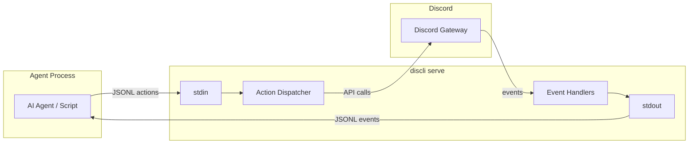

# Serve Protocol

`discli serve` implements a bidirectional communication protocol over stdin and stdout using **newline-delimited JSON (JSONL)**. Each line is a single, self-contained JSON object. Events flow out on stdout; actions flow in on stdin.



## Protocol basics

- **Transport:** stdin (actions) and stdout (events), one JSON object per line
- **Encoding:** UTF-8
- **Delimiter:** newline (`\n`) -- each line is a complete JSON object
- **Direction:** stdout is server-to-client (events), stdin is client-to-server (actions)
- **Correlation:** actions can include a `req_id` field; the corresponding response will echo it back

<Callout type="warning">
  Do not write anything to stdout other than JSONL when using serve mode programmatically. Diagnostic messages are written to stderr. If you need to debug, read stderr separately.
</Callout>

## Events (stdout)

Events are emitted by discli as things happen on Discord. Every event object has an `"event"` field identifying its type.

### Lifecycle events

| Event | Fields | Description |
|---|---|---|
| `ready` | `bot_id`, `bot_name` | Bot connected to Discord gateway |
| `slash_commands_synced` | `count`, `guilds` | Slash commands registered with Discord |
| `error` | `message` | Internal error (non-fatal) |
| `shutdown` | -- | Bot is shutting down |

### Message events

| Event | Fields | Description |
|---|---|---|
| `message` | `message_id`, `channel_id`, `channel`, `server`, `server_id`, `author`, `author_id`, `content`, `is_bot`, `mentions_bot`, `is_dm`, `timestamp`, `attachments`, `reply_to` | New message received |
| `message_edit` | `message_id`, `channel_id`, `channel`, `server`, `server_id`, `author`, `author_id`, `old_content`, `new_content`, `timestamp` | Message was edited |
| `message_delete` | `message_id`, `channel_id`, `channel`, `server`, `server_id`, `author`, `author_id`, `content` | Message was deleted |

### Interaction events

| Event | Fields | Description |
|---|---|---|
| `slash_command` | `command`, `args`, `user`, `user_id`, `channel_id`, `guild_id`, `interaction_token`, `is_admin` | Slash command invoked by a user |
| `component_interaction` | `custom_id`, `component_type`, `values`, `user`, `user_id`, `channel_id`, `message_id`, `interaction_token` | Button click or select menu choice |
| `modal_submit` | `custom_id`, `fields`, `user`, `user_id`, `channel_id`, `interaction_token` | Modal form submitted by a user |

### Voice events

| Event | Fields | Description |
|---|---|---|
| `voice_state` | `user`, `user_id`, `channel`, `channel_id`, `old_channel`, `old_channel_id`, `guild_id`, `self_mute`, `self_deaf` | User joined, left, or moved voice channels |

### Connection events

| Event | Fields | Description |
|---|---|---|
| `disconnected` | `code`, `reason` | Bot disconnected from Discord gateway |
| `resumed` | -- | Bot reconnected and resumed the session |

### Reaction events

| Event | Fields | Description |
|---|---|---|
| `reaction_add` | `emoji`, `user`, `user_id`, `message_id`, `channel_id`, `server`, `channel` | Reaction added to a message |
| `reaction_remove` | `emoji`, `user`, `user_id`, `message_id`, `channel_id`, `server`, `channel` | Reaction removed from a message |

### Member events

| Event | Fields | Description |
|---|---|---|
| `member_join` | `member`, `member_id`, `server`, `server_id` | User joined a server |
| `member_remove` | `member`, `member_id`, `server`, `server_id` | User left or was removed from a server |

### Response events

Every action sent via stdin produces a response on stdout:

| Event | Fields | Description |
|---|---|---|
| `response` | `status` (`ok` or `error`), `req_id` (if provided), plus action-specific fields | Result of a dispatched action |

#### Example event payloads

<Tabs>
  <Tab title="message">
    ```json
    {
      "event": "message",
      "server": "My Server",
      "server_id": "111111111111111111",
      "channel": "general",
      "channel_id": "222222222222222222",
      "author": "Alice#1234",
      "author_id": "333333333333333333",
      "is_bot": false,
      "content": "Hello bot!",
      "timestamp": "2026-03-15T10:30:00+00:00",
      "message_id": "444444444444444444",
      "mentions_bot": true,
      "is_dm": false,
      "attachments": [],
      "reply_to": null
    }
    ```
  </Tab>
  <Tab title="slash_command">
    ```json
    {
      "event": "slash_command",
      "command": "ask",
      "args": {"question": "What is discli?"},
      "channel_id": "222222222222222222",
      "user": "Alice#1234",
      "user_id": "333333333333333333",
      "guild_id": "111111111111111111",
      "interaction_token": "a1b2c3d4-e5f6-7890-abcd-ef1234567890",
      "is_admin": false
    }
    ```
  </Tab>
  <Tab title="response">
    ```json
    {
      "event": "response",
      "req_id": "msg-001",
      "ok": true,
      "message_id": "555555555555555555"
    }
    ```
  </Tab>
</Tabs>

## Actions (stdin)

Actions are JSON objects sent to discli via stdin. Every action must have an `"action"` field. Optionally include `"req_id"` to correlate the response.

```json
{"action": "send", "channel_id": "222222222222222222", "content": "Hello!", "req_id": "msg-001"}
```

### Messaging

| Action | Required Fields | Optional Fields | Description |
|---|---|---|---|
| `send` | `channel_id`, `content` | `embed`, `components`, `files`, `req_id` | Send a message to a channel |
| `reply` | `channel_id`, `message_id`, `content` | `embed`, `components`, `files`, `req_id` | Reply to a specific message |
| `edit` | `channel_id`, `message_id`, `content` | `embed`, `components`, `req_id` | Edit a bot message |
| `delete` | `channel_id`, `message_id` | `req_id` | Delete a message |

### Streaming

Streaming lets you progressively update a single message, similar to how ChatGPT streams responses. Content is buffered and flushed to Discord every 1.5 seconds to respect rate limits.

| Action | Required Fields | Optional Fields | Description |
|---|---|---|---|
| `stream_start` | `channel_id` | `reply_to`, `interaction_token`, `req_id` | Start a streaming message (sends "..." placeholder) |
| `stream_chunk` | `stream_id`, `content` | `req_id` | Append text to the stream buffer |
| `stream_end` | `stream_id` | `req_id` | Finalize the stream, flush remaining content |

<Callout type="tip">
  The `stream_start` response includes a `stream_id` that you must pass to subsequent `stream_chunk` and `stream_end` actions. If the content exceeds Discord's 2000-character limit, `stream_end` automatically splits it across multiple messages.
</Callout>

#### Streaming example

```json
{"action": "stream_start", "channel_id": "222222222222222222", "req_id": "s1"}
```
```json
{"event": "response", "req_id": "s1", "stream_id": "a1b2c3d4", "message_id": "555555555555555555"}
```
```json
{"action": "stream_chunk", "stream_id": "a1b2c3d4", "content": "Here is the "}
```
```json
{"action": "stream_chunk", "stream_id": "a1b2c3d4", "content": "answer to your question..."}
```
```json
{"action": "stream_end", "stream_id": "a1b2c3d4", "req_id": "s1-end"}
```

### Interactions

| Action | Required Fields | Optional Fields | Description |
|---|---|---|---|
| `interaction_respond` | `interaction_token`, `content` | `embed`, `components`, `ephemeral`, `req_id` | Immediate response to a component interaction |
| `interaction_edit` | `interaction_token` | `content`, `embed`, `components`, `req_id` | Edit the original interaction message |
| `interaction_followup` | `interaction_token`, `content` | `embed`, `components`, `req_id` | Send a follow-up response to a slash command |
| `modal_send` | `interaction_token`, `title`, `custom_id`, `fields` | `req_id` | Open a modal form in response to a component interaction |

<Callout type="note">
  Slash command interactions are automatically deferred with a "thinking" indicator. You must respond with either `interaction_followup` or `stream_start` (with the `interaction_token`) within 15 minutes, per Discord's limits.
</Callout>

### Typing

| Action | Required Fields | Optional Fields | Description |
|---|---|---|---|
| `typing_start` | `channel_id` | `req_id` | Start showing "bot is typing..." indicator |
| `typing_stop` | `channel_id` | `req_id` | Stop the typing indicator |

### Presence

| Action | Required Fields | Optional Fields | Description |
|---|---|---|---|
| `presence` | -- | `status`, `activity_type`, `activity_text`, `req_id` | Update bot status and activity |

`status` can be `online`, `idle`, `dnd`, or `invisible`. `activity_type` can be `playing`, `watching`, `listening`, or `competing`.

### Reactions

| Action | Required Fields | Optional Fields | Description |
|---|---|---|---|
| `reaction_add` | `channel_id`, `message_id`, `emoji` | `req_id` | Add a reaction to a message |
| `reaction_remove` | `channel_id`, `message_id`, `emoji` | `req_id` | Remove the bot's reaction from a message |

### Threads

| Action | Required Fields | Optional Fields | Description |
|---|---|---|---|
| `thread_create` | `channel_id`, `name` | `message_id`, `auto_archive_duration`, `content`, `req_id` | Create a thread (optionally from a message) |
| `thread_send` | `thread_id`, `content` | `files`, `req_id` | Send a message to a thread |
| `thread_list` | `channel_id` | `req_id` | List threads in a channel |
| `thread_archive` | `thread_id` | `req_id` | Archive a thread |
| `thread_rename` | `thread_id`, `name` | `req_id` | Rename a thread |
| `thread_add_member` | `thread_id`, `user_id` | `req_id` | Add a member to a thread |
| `thread_remove_member` | `thread_id`, `user_id` | `req_id` | Remove a member from a thread |

### Polls

| Action | Required Fields | Optional Fields | Description |
|---|---|---|---|
| `poll_send` | `channel_id`, `question`, `answers` | `duration_hours`, `multiple`, `content`, `req_id` | Create a poll in a channel |
| `poll_results` | `channel_id`, `message_id` | `req_id` | Get current poll results |
| `poll_end` | `channel_id`, `message_id` | `req_id` | End a poll early |

`answers` is an array of strings or objects with `text` and optional `emoji` fields. Minimum 2 answers required.

### Channels

| Action | Required Fields | Optional Fields | Description |
|---|---|---|---|
| `channel_list` | -- | `guild_id`, `req_id` | List channels (optionally filtered by server) |
| `channel_create` | `guild_id`, `name` | `type`, `req_id` | Create a channel (`text`, `voice`, or `category`) |
| `channel_info` | `channel_id` | `req_id` | Get channel details |
| `channel_edit` | `channel_id` | `name`, `topic`, `nsfw`, `slowmode`, `req_id` | Edit channel settings |
| `channel_set_permissions` | `channel_id`, `target_id`, `target_type` | `allow`, `deny`, `req_id` | Set permission overwrites for a role or member |
| `forum_post` | `channel_id`, `name`, `content` | `tags`, `embed`, `req_id` | Create a post in a forum channel |

### Members

| Action | Required Fields | Optional Fields | Description |
|---|---|---|---|
| `member_list` | `guild_id` | `limit`, `req_id` | List server members (default limit: 50) |
| `member_info` | `guild_id`, `member_id` | `req_id` | Get detailed member info including roles |
| `member_timeout` | `guild_id`, `member_id`, `duration` | `reason`, `req_id` | Timeout a member (max 2419200s / 28 days, 0 to remove) |

### Roles

| Action | Required Fields | Optional Fields | Description |
|---|---|---|---|
| `role_list` | `guild_id` | `req_id` | List server roles |
| `role_assign` | `guild_id`, `member_id`, `role_id` | `req_id` | Assign a role to a member |
| `role_remove` | `guild_id`, `member_id`, `role_id` | `req_id` | Remove a role from a member |
| `role_edit` | `guild_id`, `role_id` | `name`, `color`, `permissions`, `req_id` | Edit role properties |

### DMs

| Action | Required Fields | Optional Fields | Description |
|---|---|---|---|
| `dm_send` | `user_id`, `content` | `req_id` | Send a direct message to a user |

### Message queries

| Action | Required Fields | Optional Fields | Description |
|---|---|---|---|
| `message_list` | `channel_id` | `limit`, `req_id` | List recent messages (default limit: 20) |
| `message_get` | `channel_id`, `message_id` | `req_id` | Get a single message with full details |
| `message_search` | `channel_id` | `query`, `author`, `limit`, `req_id` | Search messages by content or author |
| `message_pin` | `channel_id`, `message_id` | `req_id` | Pin a message |
| `message_unpin` | `channel_id`, `message_id` | `req_id` | Unpin a message |
| `message_bulk_delete` | `channel_id`, `message_ids` | `req_id` | Delete multiple messages at once (2-100, max 14 days old) |

### Reactions (extended)

| Action | Required Fields | Optional Fields | Description |
|---|---|---|---|
| `reaction_users` | `channel_id`, `message_id`, `emoji` | `limit`, `req_id` | List users who reacted with a specific emoji |

### Webhooks

| Action | Required Fields | Optional Fields | Description |
|---|---|---|---|
| `webhook_list` | `channel_id` | `req_id` | List webhooks for a channel |
| `webhook_create` | `channel_id`, `name` | `avatar`, `req_id` | Create a webhook |
| `webhook_delete` | `webhook_id` | `req_id` | Delete a webhook |

### Scheduled events

| Action | Required Fields | Optional Fields | Description |
|---|---|---|---|
| `event_list` | `guild_id` | `req_id` | List scheduled events |
| `event_create` | `guild_id`, `name`, `start_time` | `end_time`, `description`, `channel_id`, `location`, `req_id` | Create a scheduled event |

### Server

| Action | Required Fields | Optional Fields | Description |
|---|---|---|---|
| `server_list` | -- | `req_id` | List servers the bot is in |
| `server_info` | `guild_id` | `req_id` | Get detailed server info |

## Request-response correlation

Every action can include a `req_id` field (any string). The response will echo it back, letting you match responses to requests in concurrent scenarios.

```json
{"action": "send", "channel_id": "123", "content": "Hello", "req_id": "abc-001"}
```

```json
{"event": "response", "req_id": "abc-001", "ok": true, "message_id": "456"}
```

<Callout type="tip">
  If you omit `req_id`, the response will still be emitted but without a correlation ID. For simple sequential agents this is fine. For agents that send multiple actions concurrently, always include `req_id`.
</Callout>

## Error handling

When an action fails, the response includes `"error"` instead of `"ok"`:

```json
{"event": "response", "req_id": "abc-002", "error": "Channel not found: 999"}
```

Common error conditions:

| Error | Cause |
|---|---|
| `Missing 'action' field` | The JSON object did not include an `action` key |
| `Unknown action: foo` | The action name is not in the action registry |
| `Channel not found: ...` | Invalid or inaccessible channel ID |
| `Missing 'guild_id'` | A required field was omitted |
| `Invalid JSON: ...` | The stdin line was not valid JSON |

Non-fatal errors (e.g., slash command sync failures) are emitted as standalone error events:

```json
{"event": "error", "message": "Failed to sync commands to My Server: ..."}
```

## Event filtering

Use command-line options to filter which events are forwarded:

```bash
# Only message and reaction events
discli serve --events messages,reactions

# Only events from a specific server
discli serve --server "My Server"

# Only events from a specific channel
discli serve --channel "#general"

# Exclude bot's own messages
discli serve --no-include-self
```

Available event filter values: `messages`, `reactions`, `members`, `edits`, `deletes`, `voice`, `interactions`.

<Callout type="note">
  The protocol currently supports **54 actions** and **17 event types**. See the [Serve Actions](/reference/serve-actions) and [Serve Events](/reference/serve-events) references for the complete list.
</Callout>

## Slash command registration

Pass a JSON file to register slash commands on startup:

```bash
discli serve --slash-commands commands.json
```

```json
[
  {
    "name": "ask",
    "description": "Ask the bot a question",
    "params": [
      {"name": "question", "type": "string", "required": true, "description": "Your question"}
    ]
  },
  {
    "name": "status",
    "description": "Check bot status"
  }
]
```

Commands are synced per-guild for instant availability. When a user invokes a slash command, a `slash_command` event is emitted with an `interaction_token` that you use to respond.

## Next steps

<CardGroup cols={2}>
  <Card title="Architecture Overview" href="/architecture/overview">
    Understand how serve mode fits into the overall discli architecture.
  </Card>
  <Card title="Building Agents" href="/guides/building-agents">
    Build AI agents that communicate over the serve protocol.
  </Card>
</CardGroup>
