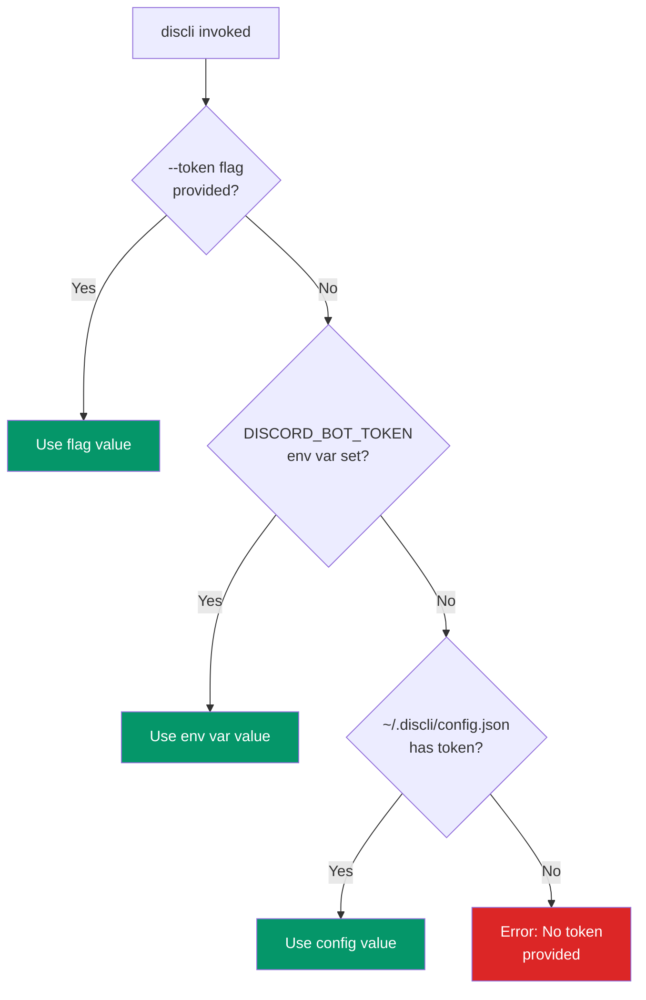

# Token Resolution

discli needs a Discord bot token to authenticate with the Discord API. The token is resolved through a three-level priority chain, giving you flexibility across different environments.

## Resolution chain



### Priority order

| Priority | Source | Example |
|---|---|---|
| 1 (highest) | `--token` CLI flag | `discli --token Bot_ABC123 message send ...` |
| 2 | `DISCORD_BOT_TOKEN` environment variable | `export DISCORD_BOT_TOKEN=Bot_ABC123` |
| 3 (lowest) | `~/.discli/config.json` file | `{"token": "Bot_ABC123"}` |

The first source that provides a non-empty value wins. If none of the three sources has a token, discli exits with an error:

```
Error: No token provided. Use --token, set DISCORD_BOT_TOKEN, or run: discli config set token YOUR_TOKEN
```

## How it works

Token resolution happens in two stages within `cli.py` and `client.py`:

**Stage 1 -- CLI entry (`cli.py`):** Click's `@click.option("--token", envvar="DISCORD_BOT_TOKEN")` handles the first two levels. If `--token` is passed, Click uses that value. If not, Click checks the `DISCORD_BOT_TOKEN` environment variable. If neither is set, the token is `None` and discli falls back to loading from the config file.

```python
# cli.py — main group
@click.option("--token", envvar="DISCORD_BOT_TOKEN", default=None)
def main(ctx, token, ...):
    if token is None:
        config = load_config()
        token = config.get("token")
    ctx.obj["token"] = token
```

**Stage 2 -- Client (`client.py`):** Before running the Discord action, `resolve_token()` verifies that a token was found. If `ctx.obj["token"]` is still `None`, it raises an error.

```python
# client.py
def resolve_token(token: str | None, config: dict) -> str:
    if token:
        return token
    config_token = config.get("token")
    if config_token:
        return config_token
    raise click.ClickException("No token provided. ...")
```

## Config file format

The config file is stored at `~/.discli/config.json`:

```json
{
  "token": "Bot_YOUR_TOKEN_HERE"
}
```

Manage it with the `config` command:

```bash
# Set your token
discli config set token YOUR_BOT_TOKEN

# View current config
discli config show
```

The file is created automatically by `discli config set`. The `~/.discli/` directory is also created if it does not exist.

<Callout type="warning">
  The config file stores the token in plain text. Ensure `~/.discli/config.json` has appropriate file permissions. On shared systems, consider using the environment variable approach instead.
</Callout>

## Why this order

The three-level priority is designed for different usage patterns:

<Tabs>
  <Tab title="Local development">
    **Config file** is the most convenient for day-to-day use. Set it once and forget:

    ```bash
    discli config set token YOUR_BOT_TOKEN
    # Now every command works without extra flags
    discli message send "#general" "Hello"
    ```

    The token persists across terminal sessions, reboots, and shell changes.
  </Tab>
  <Tab title="CI / Automation">
    **Environment variable** is the standard for CI pipelines and Docker containers. It avoids writing secrets to disk:

    ```yaml
    # GitHub Actions example
    env:
      DISCORD_BOT_TOKEN: ${{ secrets.DISCORD_BOT_TOKEN }}
    steps:
      - run: discli message send "#deploys" "Build ${{ github.sha }} deployed"
    ```

    ```bash
    # Docker example
    docker run -e DISCORD_BOT_TOKEN=... discli message send "#alerts" "Container started"
    ```
  </Tab>
  <Tab title="One-off testing">
    **CLI flag** overrides everything, useful when testing with a different bot or token:

    ```bash
    # Test with a staging bot
    discli --token Bot_STAGING_TOKEN message send "#test" "Staging check"

    # Your default config token is unaffected
    discli message send "#general" "Still uses config token"
    ```
  </Tab>
</Tabs>

## Token security

discli takes several measures to protect your token:

| Measure | Details |
|---|---|
| **Never logged** | Tokens are never written to the audit log. The `args` field in audit entries contains command arguments but the token is resolved separately and excluded. |
| **Never in output** | The `--json` output and plain-text output never include the token. |
| **Not in error messages** | If authentication fails, discli reports "Invalid bot token" without echoing the token value. |
| **Env var over disk** | The environment variable approach (priority 2) avoids persisting the token to the filesystem entirely. |

<Callout type="note">
  The token prefix `Bot ` is part of Discord's authentication header format. Some users store the full `"Bot YOUR_TOKEN"` string, while others store just the token portion. discli passes whatever value it receives directly to discord.py, which handles the header formatting.
</Callout>

## Troubleshooting

| Problem | Solution |
|---|---|
| "No token provided" | Set a token via any of the three methods described above. |
| "Invalid bot token" | Verify your token in the [Discord Developer Portal](https://discord.com/developers/applications). Regenerate it if needed. |
| Config file not found | Run `discli config set token YOUR_TOKEN` to create it. |
| Env var not picked up | Ensure the variable is exported (`export DISCORD_BOT_TOKEN=...`), not just assigned. |
| Flag ignored | The `--token` flag must come **before** the subcommand: `discli --token X message send`, not `discli message send --token X`. |

## Next steps

<CardGroup cols={2}>
  <Card title="Security Model" href="/architecture/security-model">
    Permission profiles, audit logging, and rate limiting.
  </Card>
  <Card title="Configuration" href="/getting-started/configuration">
    Full configuration guide including all config options.
  </Card>
</CardGroup>
